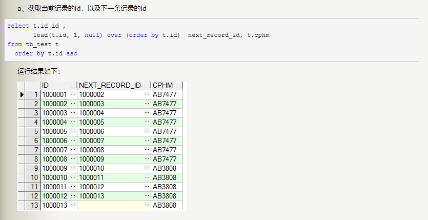

+++
title = "2018-07-27"
weight = 100
+++

## oracle

##### Parttion by
- 分组函数
- 可以进行分别进行分组，分组后各组序号重新计算。
- 123，1234，12345，12这种顺序

##### lag分析函数
- 语法
- lag(**exp_str**,**offset**,**defval**) over()
- Lead(**exp_str**,**offset**,**defval**) over()
- **exp_str**：要取的列
- **offset**：取偏移后的第几行数据
- **defval**：没有符合条件的默认值
###### eg
- 详细介绍地址：<https://www.cnblogs.com/always-online/p/5010185.html>

