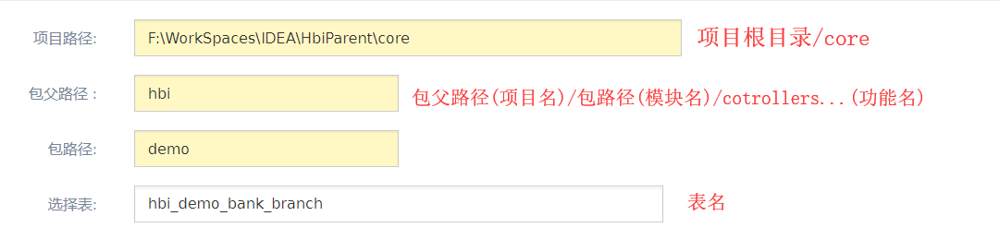
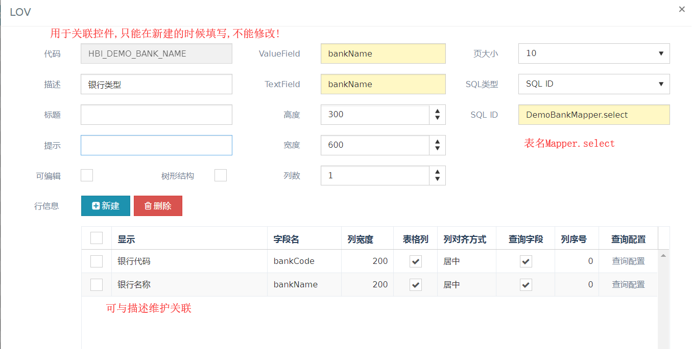
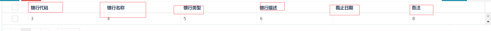
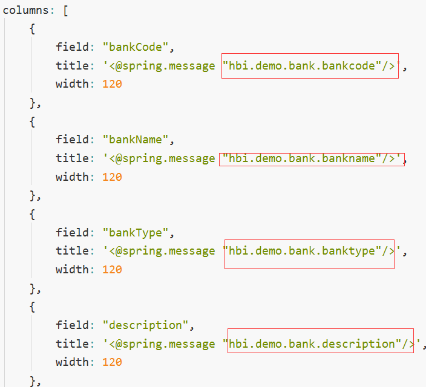
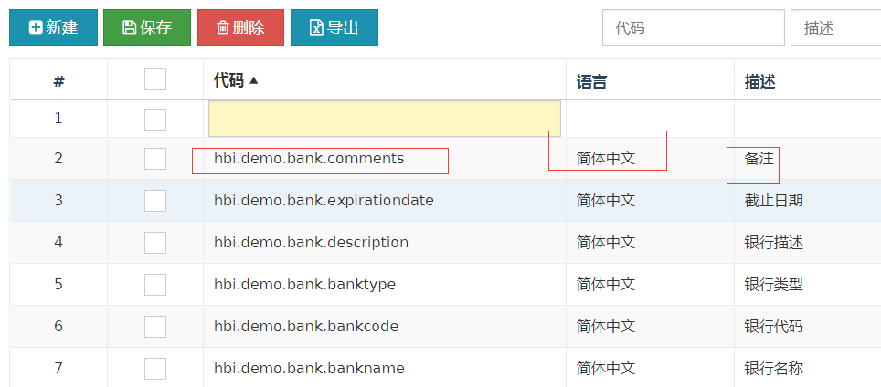
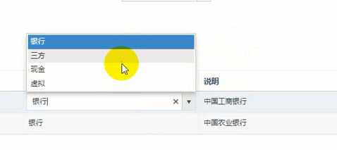
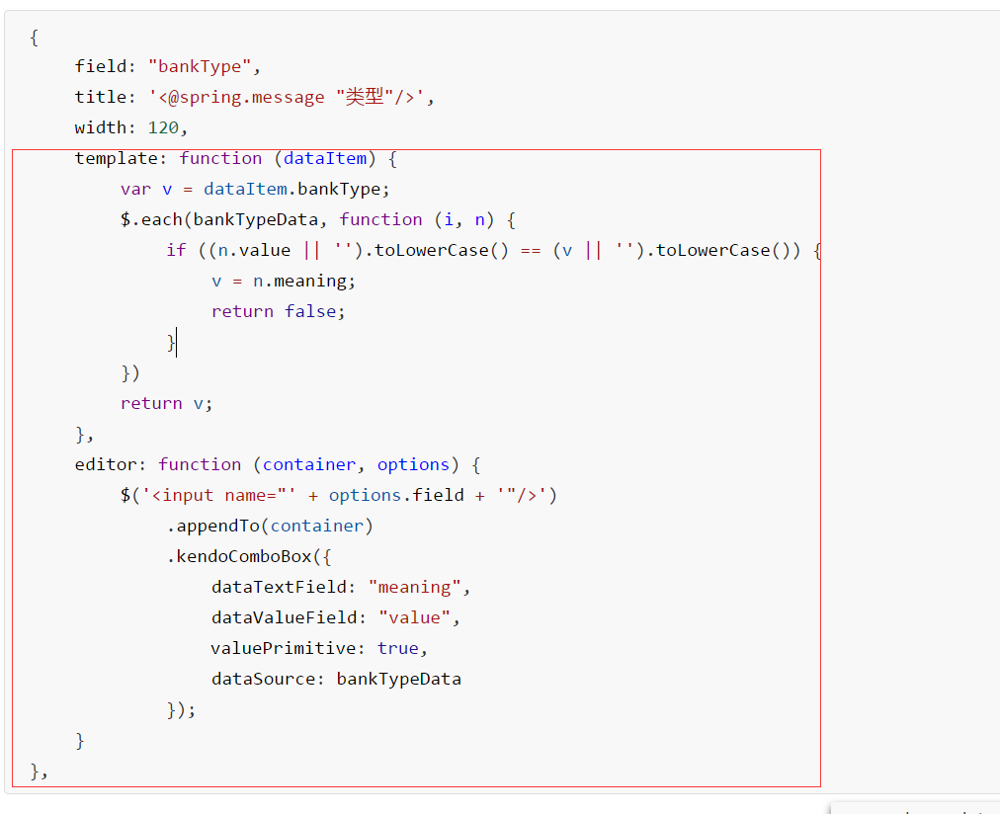
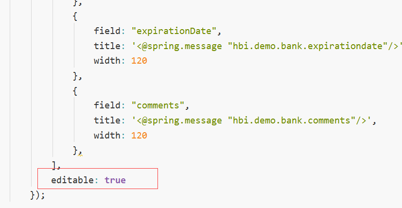
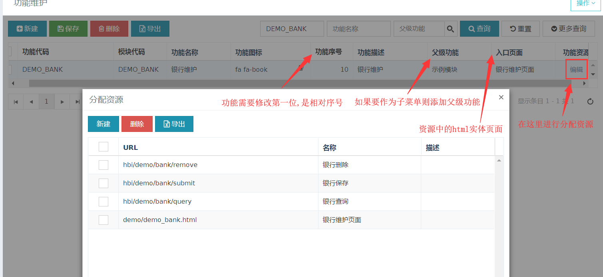

+++
title = "2018-08-04"
weight = 100
+++

## mysql
- > mysql在注册服务的时候,要使用
mysqld.install mysql --defaults-file=F:\mysql-cluster-gpl-7.4.19-win32\my.ini
即后面要加上配置文件
my-default.ini复制一份留存档,另一份改名为my.ini

## hap

[头行结构](./docs/5头行结构/HAP小作业.md)

1. > 建表

2. >生成代码
建表后打开
[http://localhost:8080/generator/generator.html](http://localhost:8080/generator/generator.html)
生成代码
说明:

生成完毕要重启服务,页面可以注入,但是方法因为带框架注释的原因无法注入

- 头编写,开始!

3. > 布局,绑定控件

4. > 布置银行名称
    生成lov(list of value)(列表值/可选择值)
    系统管理->lov定义->新建
    说明:
    

5. > 布置银行类型
    系统管理->代码维护->新建

- 头编写,结束!

- 行编写,开始!
 1. > 将表头修改为中文
    > 
    > 先将html页面中的代码写成符合项目规则的方式
    项目.模块.功能.功能属性
    > 
    > 系统管理->描述维护->cv大法
    > 

2. > 将银行名称变为下拉框且不可编辑.
   > 在顶部加入快码链接
   > 
   > 
   > 在html中绑定
   > 
   > 不可编辑,让editable=false
   > 

3. > 将编辑好的页面加入hap系统
     **通俗的说,就是先将资源放上去,然后把资源添加到对应的功能中,最后启用功能(开启访问权限)**
   (1).**先添加资源**
          将编辑好的页面中的资源(页面本体的html,里面获取数据的各个url),都添加到<系统配置-功能管理-资源管理>
   (2).**添加功能并把资源添加到功能中**
          将添加好的资源配置到功能维护中具体的功能中(html和 url都要添加),<系统配置-功能管理-功能维护>
   
   (3).**功能分配(开启权限)**
          将功能添加到页面左侧功能栏中,找到刚刚添加的功能,是否启用勾上,<系统配置-功能管理-功能分配>
          