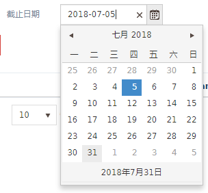

---

---

# 银行头行结构

>作者：陈新凯
>时间：2017-8-1
>版本：1.0

## 目的

> 纸上谈兵不如实际演练，通过小作业的形式让大家对HAP开发流程以及各种控件有个初步的认识。

## 自动生成代码网址

http://localhost:8080/generator/generator.html

## Kendo UI API网址

https://docs.telerik.com/kendo-ui/api/javascript/ui/combobox

## 快码

### 银行类型

HBI.DEMO.BANK_TYPE

| 值 | 含义 | 描述 |
| ---- | ---- | ------ |
| VIRTUAL        | 虚拟 | 其他虚拟账户       |
| CASH           | 现金 | 现金收、付款使用   |
| ONLINE_PAYMENT | 三方 | 三方渠道           |
| BANK           | 银行 | 银行账户对应的银行 |

## LOV

###银行名称 

HBI_DEMO_BANK_NAME

| 显示     | 字段名   |
| -------- | -------- |
| 银行名称 | bankName |
| 银行简码 | bankCode |

# 银行

## 表设计

### 表结构

| 字段名                | 类型        | 长度        | 允许空值    | 默认值      | 描述                       |
| --------------------- | ----------- | ----------- | ----------- | ----------- | -------------------------- |
| BANK_ID               | 序列        |             | 否          |             | 表ID，主键，供其他表做外键 |
| BANK_CODE             | Varchar     | 30          | 否          |             | 银行简码                   |
| BANK_NAME             | Varchar     | 240         | 否          |             | 银行名称                   |
| BANK_TYPE             | Varchar     | 30          | 否          |             | 银行类型                   |
| DESCRIPTION           | Varchar     | 240         | 是          |             | 说明                       |
| EXPIRATION_DATE       | DATE        |             | 是          |             | 截止日期                   |
| COMMENTS              | Varchar     | 240         | 是          |             | 备注                       |
| PROGRAM_ID            | BigInt      |             | 是          |             |                            |
| REQUEST_ID            | BigInt      |             | 是          |             |                            |
| OBJECT_VERSION_NUMBER | BigInt      |             | 否          | 1           | 行版本号，用来处理锁       |
| 索引类型              | 字段1(必须) | 字段2(可选) | 字段3(可选) | 字段4(可选) | 字段5(可选)                |
| 主键                  | BANK_ID     |             |             |             |                            |
| 唯一性索引            | BANK_CODE   |             |             |             |                            |

### 建表脚本

```sql
Create Table HAP_DEV.HBI_DEMO_BANK
(
 BANK_ID bigint Not Null auto_increment primary key,
 BANK_CODE Varchar(30) Not Null,
 BANK_NAME Varchar(240) Not Null,
 BANK_TYPE Varchar(30) Not Null,
 DESCRIPTION Varchar(240),
 EXPIRATION_DATE DATE,
 COMMENTS Varchar(240),
 PROGRAM_ID BigInt,
 REQUEST_ID BigInt,
 OBJECT_VERSION_NUMBER BigInt Not Null Default 1,
 CREATION_DATE  datetime Not Null Default CURRENT_TIMESTAMP,
 CREATED_BY BigInt Not Null Default -1,
 LAST_UPDATED_BY BigInt Not Null Default -1,
 LAST_UPDATE_DATE datetime Not Null Default CURRENT_TIMESTAMP,
 LAST_UPDATE_LOGIN BigInt Default -1,
 ATTRIBUTE_CATEGORY VARCHAR(30),
 ATTRIBUTE1 VARCHAR(150),
 ATTRIBUTE2 VARCHAR(150),
 ATTRIBUTE3 VARCHAR(150),
 ATTRIBUTE4 VARCHAR(150),
 ATTRIBUTE5 VARCHAR(150),
 ATTRIBUTE6 VARCHAR(150),
 ATTRIBUTE7 VARCHAR(150),
 ATTRIBUTE8 VARCHAR(150),
 ATTRIBUTE9 VARCHAR(150),
 ATTRIBUTE10 VARCHAR(150),
 ATTRIBUTE11 VARCHAR(150),
 ATTRIBUTE12 VARCHAR(150),
 ATTRIBUTE13 VARCHAR(150),
 ATTRIBUTE14 VARCHAR(150),
 ATTRIBUTE15 VARCHAR(150)
);
ALTER TABLE HAP_DEV.HBI_DEMO_BANK COMMENT '银行表';
ALTER TABLE HAP_DEV.HBI_DEMO_BANK MODIFY `BANK_ID` bigint Not Null auto_increment Comment '表ID，主键，供其他表做外键';
ALTER TABLE HAP_DEV.HBI_DEMO_BANK MODIFY `BANK_CODE` Varchar(30) Not Null Comment '银行简码';
ALTER TABLE HAP_DEV.HBI_DEMO_BANK MODIFY `BANK_NAME` Varchar(240) Not Null Comment '银行名称';
ALTER TABLE HAP_DEV.HBI_DEMO_BANK MODIFY `BANK_TYPE` Varchar(30) Not Null Comment '银行类型';
ALTER TABLE HAP_DEV.HBI_DEMO_BANK MODIFY `DESCRIPTION` Varchar(240) Comment '说明';
ALTER TABLE HAP_DEV.HBI_DEMO_BANK MODIFY `EXPIRATION_DATE` DATE Comment '截止日期';
ALTER TABLE HAP_DEV.HBI_DEMO_BANK MODIFY `COMMENTS` Varchar(240) Comment '备注';
ALTER TABLE HAP_DEV.HBI_DEMO_BANK MODIFY `OBJECT_VERSION_NUMBER` BigInt Not Null Default 1 Comment '行版本号，用来处理锁';

ALTER TABLE `HBI_DEMO_BANK` ADD UNIQUE (`BANK_CODE`);
```

## 界面截图


# 分行

## 表设计

### 表结构

| 字段名                | 类型           | 长度        | 允许空值    | 默认值      | 描述                       |
| --------------------- | -------------- | ----------- | ----------- | ----------- | -------------------------- |
| BANK_BRANCH_ID        | 序列           |             | 否          |             | 表ID，主键，供其他表做外键 |
| BANK_ID               | BigInt         |             | 否          |             | 银行ID                     |
| BRANCH_NAME           | Varchar        | 240         | 否          |             | 分行名称                   |
| BRANCH_TYPE           | Varchar        | 80          | 否          |             | 分行类型                   |
| BRANCH_NO             | Varchar        | 80          | 否          |             | 联行号                     |
| SWIFT_CODE            | Varchar        | 240         | 是          |             | Swift   code               |
| ADDRESS               | Varchar        | 240         | 否          |             | 地址                       |
| DESCRIPTION           | Varchar        | 240         | 是          |             | 说明                       |
| EXPIRATION_DATE       | DATE           |             | 是          |             | 截止日期                   |
| COMMENTS              | Varchar        | 240         | 是          |             | 备注                       |
| PROGRAM_ID            | BigInt         |             | 是          |             |                            |
| REQUEST_ID            | BigInt         |             | 是          |             |                            |
| OBJECT_VERSION_NUMBER | BigInt         |             | 否          | 1           | 行版本号，用来处理锁       |
| 索引类型              | 字段1(必须)    | 字段2(可选) | 字段3(可选) | 字段4(可选) | 字段5(可选)                |
| 主键                  | BANK_BRANCH_ID |             |             |             |                            |
| 普通索引              | BANK_ID        |             |             |             |                            |


### 建表脚本

```sql
Create Table HAP_DEV.HBI_DEMO_BANK_BRANCH
(
 BANK_BRANCH_ID bigint Not Null auto_increment primary key,
 BANK_ID BigInt Not Null,
 BRANCH_NAME Varchar(240) Not Null,
 BRANCH_TYPE Varchar(80) Not Null,
 BRANCH_NO Varchar(80) Not Null,
 SWIFT_CODE Varchar(240),
 ADDRESS Varchar(240) Not Null,
 DESCRIPTION Varchar(240),
 EXPIRATION_DATE DATE,
 COMMENTS Varchar(240),
 PROGRAM_ID BigInt,
 REQUEST_ID BigInt,
 OBJECT_VERSION_NUMBER BigInt Not Null Default 1,
 CREATION_DATE  datetime Not Null Default CURRENT_TIMESTAMP,
 CREATED_BY BigInt Not Null Default -1,
 LAST_UPDATED_BY BigInt Not Null Default -1,
 LAST_UPDATE_DATE datetime Not Null Default CURRENT_TIMESTAMP,
 LAST_UPDATE_LOGIN BigInt Default -1,
 ATTRIBUTE_CATEGORY VARCHAR(30),
 ATTRIBUTE1 VARCHAR(150),
 ATTRIBUTE2 VARCHAR(150),
 ATTRIBUTE3 VARCHAR(150),
 ATTRIBUTE4 VARCHAR(150),
 ATTRIBUTE5 VARCHAR(150),
 ATTRIBUTE6 VARCHAR(150),
 ATTRIBUTE7 VARCHAR(150),
 ATTRIBUTE8 VARCHAR(150),
 ATTRIBUTE9 VARCHAR(150),
 ATTRIBUTE10 VARCHAR(150),
 ATTRIBUTE11 VARCHAR(150),
 ATTRIBUTE12 VARCHAR(150),
 ATTRIBUTE13 VARCHAR(150),
 ATTRIBUTE14 VARCHAR(150),
 ATTRIBUTE15 VARCHAR(150)
);
ALTER TABLE HAP_DEV.HBI_DEMO_BANK_BRANCH COMMENT '银行分行表';
ALTER TABLE HAP_DEV.HBI_DEMO_BANK_BRANCH MODIFY `BANK_BRANCH_ID` bigint Not Null auto_increment Comment '表ID，主键，供其他表做外键';
ALTER TABLE HAP_DEV.HBI_DEMO_BANK_BRANCH MODIFY `BANK_ID` BigInt Not Null Comment '银行ID';
ALTER TABLE HAP_DEV.HBI_DEMO_BANK_BRANCH MODIFY `BRANCH_NAME` Varchar(240) Not Null Comment '分行名称';
ALTER TABLE HAP_DEV.HBI_DEMO_BANK_BRANCH MODIFY `BRANCH_TYPE` Varchar(80) Not Null Comment '分行类型';
ALTER TABLE HAP_DEV.HBI_DEMO_BANK_BRANCH MODIFY `BRANCH_NO` Varchar(80) Not Null Comment '联行号';
ALTER TABLE HAP_DEV.HBI_DEMO_BANK_BRANCH MODIFY `SWIFT_CODE` Varchar(240) Not Null Comment 'Swift code';
ALTER TABLE HAP_DEV.HBI_DEMO_BANK_BRANCH MODIFY `ADDRESS` Varchar(240) Not Null Comment '地址';
ALTER TABLE HAP_DEV.HBI_DEMO_BANK_BRANCH MODIFY `DESCRIPTION` Varchar(240) Comment '说明';
ALTER TABLE HAP_DEV.HBI_DEMO_BANK_BRANCH MODIFY `EXPIRATION_DATE` DATE Comment '截止日期';
ALTER TABLE HAP_DEV.HBI_DEMO_BANK_BRANCH MODIFY `COMMENTS` Varchar(240) Comment '备注';
ALTER TABLE HAP_DEV.HBI_DEMO_BANK_BRANCH MODIFY `OBJECT_VERSION_NUMBER` BigInt Not Null Default 1 Comment '行版本号，用来处理锁';

ALTER TABLE `HBI_DEMO_BANK_BRANCH` ADD INDEX HBI_DEMO_BANK_BRANCH.HBI_DEMO_BANK_BRANCH_N1(`BANK_ID`);	

```

## 界面截图


# 常见控件

## FORM

### 文本


```html
<!--银行简码 文本-->
<div class="col-xs-4">
	<div class="form-group">
		<label class="col-md-4 control-label"><@spring.message
			"银行简码"/></label>
		<div class="col-xs-8">
			<input id="bankCode" type="text" data-role="maskedtextbox" style="float:left;width:150px;margin-right:5px;" data-bind="value:model.bankCode" class="k-textbox">
		</div>
	</div>
</div>
```


### 日期



```html
<!--截止时间 日期-->
<div class="col-xs-4">
	<div class="form-group">
		<label class="col-md-4 control-label"><@spring.message
			"截止日期"/></label>
		<div class="col-xs-8">
			<input  id="expirationDate" style="width:150px;margin-right:5px;" data-bind="value:model.expirationDate">
		</div>
		<script>
			$("#expirationDate").kendoDatePicker({
				format: "{0:yyyy-MM-dd}",
			}).data("kendoDatePicker");
		</script>
	</div>
</div>
```

### 下拉框


在快码维护定义好快码值，银行类型：HBI.DEMO.BANK_TYPE


引用快码值

```html
<script src="${base.contextPath}/common/code?bankTypeData=HBI.DEMO.BANK_TYPE" type="text/javascript"></script>
```


js渲染下拉框

```html
<!--银行类型 下拉框-->
<div class="col-xs-4">
	<div class="form-group">
		<label class="col-md-4 control-label"><@spring.message
			"hbi.demo.bank.bankType"/></label>
		<div class="col-xs-8">
			<input id="bankType" required type="text" style="width:150px;margin-right:5px;" data-bind="value:model.bankType">
		</div>
		<script>
			$("#bankType").kendoComboBox({
				dataSource: bankTypeData,
				valuePrimitive: true,
				dataTextField: "meaning",
				dataValueField: "value"
			});
		</script>
	</div>
</div>
```


### LOV


LOV维护界面定义好LOV


代码

```html
<!--银行名称 LOV-->
<div class="col-xs-4">
	<div class="form-group">
		<label class="col-md-4 control-label"><@spring.message
			"银行名称"/></label>
		<div class="col-xs-8">
			<input id="bankName" type="text" style="width:150px;margin-right:5px;" data-bind="value:model.bankName,text:model.bankName">
			<script>
				$("#bankName").kendoLov($.extend(${lovProvider.getLov(base.contextPath, base.locale, "HBI_DEMO_BANK_NAME")}, {}))
			</script>
		</div>
	</div>
</div>
```

### 表单校验器

kendo ui自带表单校验，包括必输，唯一性，可以自定义报错和规则等等，详细使用参照下面网址：

https://docs.telerik.com/kendo-ui/api/javascript/ui/validator

#### 初始化

```javascript
// form表单校验
window.onload=function () {
    var validator = $("#myForm").kendoValidator({
        messages: {
            required: '<@spring.message "必输"/>',
        },
        rules: {}
    }).data("kendoValidator");
}
```

注意：`myForm`对应form表单id。

#### 调用

以保存校验为例

```javascript
saveFunction: function () {
    //调用表单校验器校验必输字段
    var b = $("#myForm").data("kendoValidator").validate();
    if (!b) {
        Hap.showToast({
            type:"info",
            message: $l('<@spring.message "头上存在必输字段未输！"/>')
        })
        return;
    }
    //后续保存逻辑...
},
```

#### 提示引用

```html
<input ... name="bankCode" required ...>
<div style="position:absolute;z-index: 2;left:90%;top:-2px;"><span data-for="bankCode" class="k-invalid-msg" ></span></div>
```

注意：`name`和`data-for`对应。

### 禁用

#### 文本

```javascript
$("#bankCode").attr("readonly",true).css("background", "#EEEEEE");
$("#bankName").attr("readonly",true).css("background", "#EEEEEE");
```

#### 下拉框
```javascript
$("#bankType").data("kendoComboBox").enable(false);
```

#### LOV
```javascript
$("#bankName").data("kendoLov").enable(false);
$("#bankName").attr("readonly",true).css("background", "#EEEEEE");
```

#### 时间框
```javascript
$("#expirationDate").data("kendoDatePicker").readonly();
$("#expirationDate").css("background", "#EEEEEE");
```

### 按钮

#### 重置

```html
<span class="btn btn-default pull-right" type="button" data-bind="click:reset">
    <i class="fa fa-eraser" style="margin-right: 3px;"></i><@spring.message "hap.reset"/>
</span>
```

#### 查询

```html
<span class="btn btn-primary pull-right" data-bind="click:query" type="submit" style="margin-right: 3px;"><i class="fa fa-search"></i><@spring.message "hap.query"/></span>
```


#### 新建

##### 新建行

```html
<span class="btn btn-primary k-grid-add pull-left" style="float:left;margin-right:5px;" data-bind="click:create"><@spring.message "hap.new"/></span>
```

##### 新建头行

预留窗口div

```html
<div id="newWin" style="display: none"></div>
```

新建按钮对应函数

```html
<span class="btn btn-primary k-grid-add pull-left" style="float:left;margin-right:5px;" data-bind="click:newResource"><@spring.message "hap.new"/></span>
```

newResource方法

```javascript
newResource: function (e) {
	var win = $('#newWin').kendoWindow({
		iframe: true,
		draggable: false,
		content: '${base.contextPath}/demo/demo_bank_branch.html',
	}).data('kendoWindow');
	win.title('<@spring.message "hap.new"/>');
	win.maximize().open();
}
```

#### 保存

##### 保存行

```html
<span class="btn btn-success k-grid-save-changes" data-bind="click:save" style="float:left;margin-right:5px;"><@spring.message "hap.save"/></span>
```


##### 保存头行

```html
<span class="btn btn-success k-grid-save-changes" data-bind="click:saveFunction" style="float:left;margin-right:5px;"><@spring.message "hap.save"/></span>
```

```javascript
saveFunction: function () {
	Hap.submitForm({
		url: '${base.contextPath}/hbi/demo/bank/submit',
		formModel: viewModel.model,
		grid: {"demoBankBranchList": $("#grid")},
		success: function (data) {
			if (data.success) {
				if(!bankId||bankId==0){
					//回写主键
					bankId=data.rows[0].bankId;
				}
				$('#grid').data('kendoGrid').dataSource.read();
				Hap.showToast({
					type:"success",
					message: '<@spring.message "保存成功"/>'
				});
			}
		},
		failure:function (arg) {
			Hap.showToast({
				type:"error",
				message: '<@spring.message "保存失败"/>'
			});
		}
	});
}
```

后台代码

```java
@Override
public List<DemoBank> myBatchUpdate(IRequest iRequest, List<DemoBank> demoBanks) {
    if (demoBanks != null && !demoBanks.isEmpty()) {
        for (int i = 0; i < demoBanks.size(); i++) {
            DemoBank demoBank = demoBanks.get(i);
            //根据是否拥bankId有判断是insert还是update
            Long bankId = demoBank.getBankId();
            if (bankId == null) {
                //insert
                //保存头
                demoBankService.insertSelective(iRequest, demoBank);
                //insert之后便有主键了
                bankId = demoBank.getBankId();
                //保存行
                List<DemoBankBranch> demoBankBranchList = demoBank.getDemoBankBranchList();
                for (int j = 0; j < demoBankBranchList.size(); j++) {
                    DemoBankBranch demoBankBranch = demoBankBranchList.get(j);
                    demoBankBranch.setBankId(bankId);
                    demoBankBranchService.insertSelective(iRequest, demoBankBranch);
                }

            } else {
                //update
                //保存头
                demoBankService.updateByPrimaryKeySelective(iRequest, demoBank);
                //保存行的时候需要区分行是新建还是更新
                List<DemoBankBranch> demoBankBranchList = demoBank.getDemoBankBranchList();
                if (demoBankBranchList != null && !demoBankBranchList.isEmpty()) {
                    for (int j = 0; j < demoBankBranchList.size(); j++) {
                        DemoBankBranch demoBankBranch = demoBankBranchList.get(j);
                        Long bankBranchId = demoBankBranch.getBankBranchId();
                        if (bankBranchId == null) {
                            demoBankBranch.setBankId(bankId);
                            demoBankBranchService.insertSelective(iRequest, demoBankBranch);
                        } else {
                            demoBankBranchService.updateByPrimaryKeySelective(iRequest, demoBankBranch);
                        }
                    }
                }
            }
        }
        return demoBanks;
    }
    return null;
}
```

#### 删除

##### 删除行

```html
<span class="btn btn-danger pull-left" data-bind="click:remove" style="float:left;"><@spring.message "hap.delete"/></span>
```

##### 删除头行

前端无差异，后台不能再使用框架自动生成的代码，需要先删除行，再删除头

```java
@Override
public int myBatchDelete(IRequest iRequest, List<DemoBank> demoBanks) throws Exception {
    int count = 0;
    if (demoBanks != null && !demoBanks.isEmpty()) {
        for (int i = 0; i < demoBanks.size(); i++) {
            DemoBank demoBank = demoBanks.get(i);
            Long bankId = demoBank.getBankId();
            if (bankId == null) {
                throw new Exception("缺失主键");
            }
            //查询对应行
            DemoBankBranch demoBankBranch = new DemoBankBranch();
            demoBankBranch.setBankId(bankId);
            List<DemoBankBranch> demoBankBranches = demoBankBranchService.select(iRequest, demoBankBranch, 1, 0);
            if (demoBankBranches != null && !demoBankBranches.isEmpty()) {
                //批量删除行
                demoBankBranchService.batchDelete(demoBankBranches);
            }
            //删除头
            int n = demoBankService.deleteByPrimaryKey(demoBank);
            count += n;
        }
    }
    return count;
}
```


#### 初始化头部数据

```javascript
//初始化头部数据
if(bankId){
    //如果存在headerId赋默认值
    viewModel.model.set("bankId",bankId);
    //获取头数据
    $.ajax({
        type   : "POST",
        url: "${base.contextPath}/hbi/demo/bank/query",
        data: { bankId : bankId },
        success: function(json) {
            var row = json.rows[0] || {};
            for (var k in row) {
                viewModel.model.set(k, row[k]);
            }
        }
    });
}
```


## GRID

### 字段内容居中

```css
<style>
    /*表格标题居中显示*/
    .k-grid th{
        text-align: center!important;
    }
    /*表格列居中*/
    .k-grid tr{
        text-align: center!important;
    }
</style>
```

### 下拉框


```javascript
{
	field: "bankType",
	title: '<@spring.message "类型"/>',
	width: 120,
	template: function (dataItem) {
		var v = dataItem.bankType;
		$.each(bankTypeData, function (i, n) {
			if ((n.value || '').toLowerCase() == (v || '').toLowerCase()) {
				v = n.meaning;
				return false;
			}
		})
		return v;
	},
	editor: function (container, options) {
		$('<input name="' + options.field + '"/>')
			.appendTo(container)
			.kendoComboBox({
				dataTextField: "meaning",
				dataValueField: "value",
            	 valuePrimitive: true,
				dataSource: bankTypeData
			});
	}
},
```

### 不可编辑

方式一：静态不可编辑

```javascript
editable: false
```

方式二：动态不可编辑

```javascript
$("#grid").data("kendoGrid").setOptions({
    editable: false
});;
```


### 必输

```javascript
dataSource = new kendo.data.DataSource({
	...
	schema: {
		...
		model: {
			...
			fields: {
				branchName: { validation: {required: true}},
				branchType:{ validation: {required: true}},
				branchNo: { validation: {required: true}},
				address: { validation: {required: true}},
			}
		}
	}
});
```


## 其他

#### 利用freemarker获取头页面主键

```javascript
var bankId = '${RequestParameters.bankId!0}';
```

行界面通过头Id查询行

```javascript
return  Hap.prepareQueryParameter({"bankId":bankId}, options);
```


# HAP后端

## 其他

### IRequest转换方法

使用前必须继承BaseController

```java
IRequest requestContext = createRequestContext(request);
```

## 框架自带CURD方法

Base命名的类通常都是框架封装好的接口类

### IBaseService

#### 查询

##### select

```java
/**
 * 根据条件查询
 * @param request 请求
 * @param condition 条件
 * @param pageNum 开始页数
 * @param pageSize 查询大小
 * @return
 */
List<T> select(IRequest request, T condition, int pageNum, int pageSize);
```

##### selectByPrimaryKey

```java
/**
 * 根据主键查询
 * @param request 请求
 * @param record 包含主键
 * @return 符合条件的数据
 */
T selectByPrimaryKey(IRequest request, T record);
```

##### selectAll

```java
/**
 * 查询所有数据:建议慎用
 * @param iRequest 请求
 * @return 该表下所有数据
 */
List<T> selectAll(IRequest iRequest);
```

##### selectOptions

```java
/**
 * 查询指定的列
 * @param request 请求
 * @param record 条件
 * @param criteria 数组,指定列
 * @param pageNum 开始页数
 * @param pageSize 查询大小
 * @return 符合条件的数据(限制列数)
 */
List<T> selectOptions(IRequest request, T record, Criteria criteria, Integer pageNum, Integer pageSize);
```

#### 插入

##### insert

```java
/**
 * 插入数据
 * @param request
 * @param record
 * @return
 */
T insert(IRequest request, @StdWho T record);
```

##### insertSelective

```java
/**
 * 插入数据(空字段不插入)
 * @param request
 * @param record
 * @return
 */
T insertSelective(IRequest request, @StdWho T record);
```

#### 更新

##### updateByPrimaryKey

```java
/**
 * 根据主键更新数据
 * @param request
 * @param record
 * @return
 */
T updateByPrimaryKey(IRequest request, @StdWho T record);
```

##### updateByPrimaryKeySelective

```java
/**
 * 根据主键更新数据(空字段不更新)
 * @param request
 * @param record
 * @return
 */
@Transactional(rollbackFor = Exception.class)
T updateByPrimaryKeySelective(IRequest request, @StdWho T record);
```

##### updateByPrimaryKeyOptions

```java
/**
 * 根据主键更新数据(指定列更新)
 * @param request
 * @param record
 * @param criteria
 * @return
 */
@Transactional(rollbackFor = Exception.class)
T updateByPrimaryKeyOptions(IRequest request, @StdWho T record,Criteria criteria);
```

##### batchUpdate

```java
/**
 * 批量更新
 * @param request
 * @param list
 * @return
 */
List<T> batchUpdate(IRequest request, @StdWho List<T> list);
```

#### 删除

##### deleteByPrimaryKey

```java
/**
 * 根据主键删除
 * @param record 
 * @return 删除成功条数
 */
int deleteByPrimaryKey(T record);
```

##### batchDelete

```java
/**
 * 批量删除
 * @param list
 * @return
 */
int batchDelete(List<T> list);
```

`注意：`BaseMapper和BaseService里面封装好的区别，一个是带有stoWho字段（Service），一个没有（Mapper）,**推荐使用Service，否则会出现乐观锁问题。**